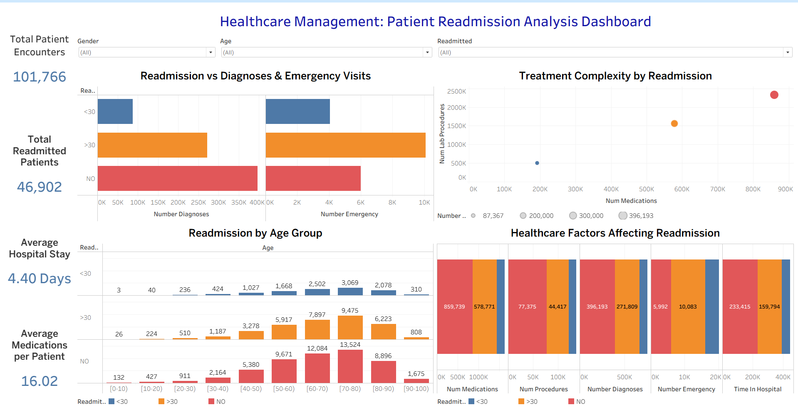
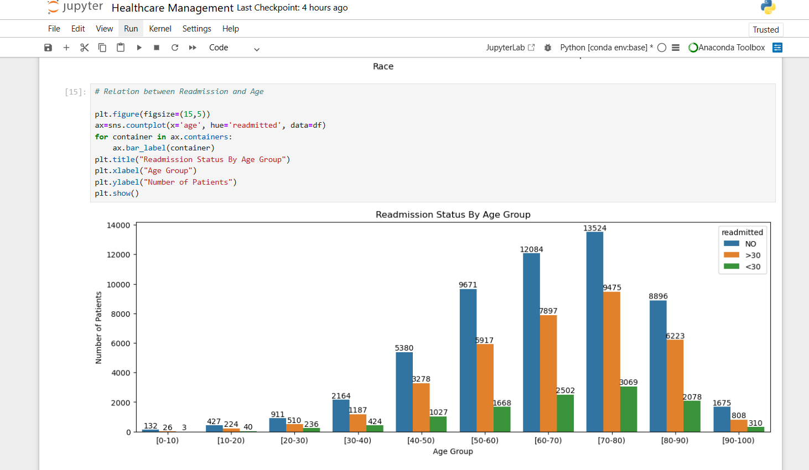
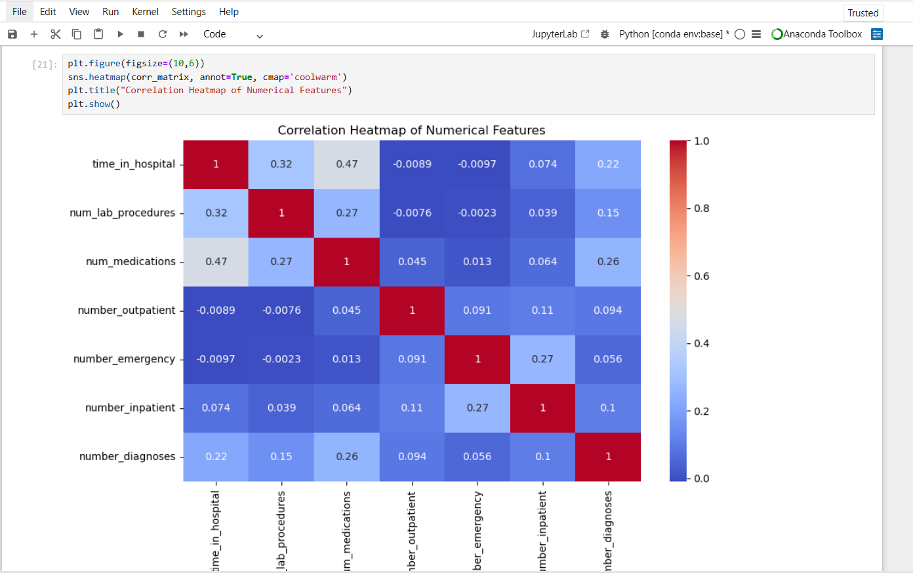

# 🏥 Healthcare Patient Readmission Analysis

🚀 End-to-End Data Analysis Project using Excel, SQL, Python, and Tableau

---

## 📌 Project Overview

This project analyzes hospital patient data to identify factors influencing **readmission within 30 days**.
The goal is to help healthcare providers identify high-risk patients and improve care strategies using data-driven insights.

---

## 📊 Dataset Information

* 📁 Records: **101,766 patient encounters**
* 📌 Features: **50 healthcare variables**
* 📂 Source: Public diabetic dataset
* 🔍 Focus: Patient readmission prediction

---

## 🎯 Objectives

* Analyze patterns in patient readmissions
* Identify key factors affecting readmission
* Perform exploratory data analysis (EDA)
* Build an interactive dashboard for insights

---

## 🛠️ Tools & Technologies

| Tool        | Purpose                           |
| ----------- | --------------------------------- |
| Excel       | Data exploration & pivot analysis |
| SQL (MySQL) | Data querying & aggregation       |
| Python      | EDA & visualization               |
| Tableau     | Interactive dashboard             |

---

## 📈 Project Workflow

### 🔹 Excel Analysis

* Statistical summary of numerical features
* Pivot tables for age & gender analysis
* Readmission distribution visualization

### 🔹 SQL Analysis

* Total patient encounters
* Top 10 diagnoses
* Readmission percentage
* Age distribution
* Medication analysis

### 🔹 Python (EDA)

* Distribution analysis
* Correlation heatmap
* Medication pattern analysis
* Outlier detection

### 🔹 Tableau Dashboard

* KPI metrics
* Interactive filters
* Multi-dimensional visualizations

---

## 📊 Key Insights

* 👴 Older patients (60–80 years) show higher readmission rates
* 💊 More medications & diagnoses → higher readmission risk
* 🚑 Emergency visits strongly influence readmission
* 🏥 Longer hospital stays indicate complex cases

---

## 📷 Dashboard Preview



---

## 📊 Sample Visualizations

### Age vs Readmission



### Correlation Heatmap



---

## 💡 Business Impact

The analysis helps healthcare providers identify high-risk patients based on age, treatment complexity, and emergency visits.
These insights support proactive care strategies, reduce readmission rates, and optimize hospital resources.

---

## 📄 Project Report

Detailed project report available here:
👉 [View Report](report/healthcare_readmission_analysis_report.pdf)

---

## 📁 Project Structure

```
healthcare-readmission-analysis/
│
├── data/
├── excel/
├── sql/
├── python/
├── tableau/
├── visuals/
├── report/
└── README.md
```

---

## 🚀 Future Improvements

* Build machine learning model for prediction
* Add more healthcare datasets
* Deploy dashboard online

---

## 👤 Author

**Ayushman**
Aspiring Data Analyst | Python, SQL, Tableau | Data Analysis & Business Storytelling

📫 Connect with me: www.linkedin.com/in/ayushman-manav-data-analytics

---

⭐ If you found this project useful, consider giving it a star!
